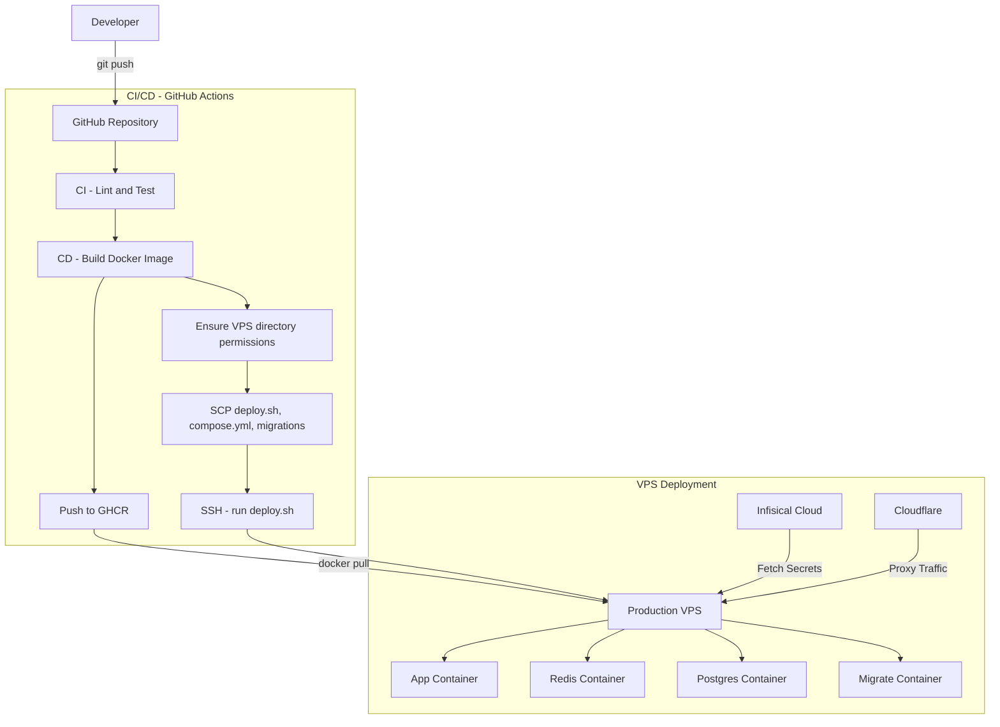

# Idea-dump
Idea Dump is a platform for sharing and storing ideas.
Live hosted on [ideas.soylab.dpdns.org](https://ideas.soylab.dpdns.org/).

## System Architecture

### 1. Deployment & CI/CD Pipeline


## Features

- **Idea Management**: Create, edit, and delete ideas
- **Health Check**: `/health` endpoint for monitoring

## Tech Stack

| Component | Technology |
|-----------|------------|
| Application | TypeScript, NestJS |
| Database | PostgreSQL |
| Cache | Redis |
| CI/CD | GitHub Actions |
| Registry | GitHub Container Registry (GHCR) |
| DNS/SSL | Cloudflare |
| Secrets | Infisical Cloud |
| Deployment | Docker Compose on VPS |

## Prerequisites

- Node.js 22+ (or use Docker)
- Docker and Docker Compose
- PostgreSQL 15+ (or use Docker)
- Redis 7+ (or use Docker)

## Local Development

### Quick Start

```bash
# Clone the repository
git clone https://github.com/gopal-chhetri/idea-dump.git
cd idea-dump

# Start all services (app, database, redis)
npm run start:dev

# Or with Docker Compose directly
cd deployments/local-dev
docker compose up --build
```

The app will be available at `http://localhost:3000`.


## Environment Variables

Copy `deployments/local-dev/.env.sample` to `deployments/local-dev/.env` and configure:

## API Documentation

Once running, visit:
- **Swagger UI**: `http://localhost:3000/api/docs`

### Key Endpoints

| Method | Path | Description | Auth |
|--------|------|-------------|------|
| POST | `/api/auth/register` | Register new user | No |
| POST | `/api/auth/login` | Login | No |
| POST | `/api/ideas` | Create idea | Yes |
| GET | `/api/ideas` | List user's ideas | Yes |
| DELETE | `/api/ideas/:id` | Deactivate idea | Yes |

### CI/CD Pipeline

Push to `main` triggers:
1. **CI**: Lint → Test → Build
2. **CD**: Build Docker image → Push to GHCR → Ensure VPS permissions → SCP deploy files and root `migrations/` → SSH `deploy.sh` on VPS

### Image Versioning

| Trigger | Tag | Example |
|---------|-----|---------|
| Push to main | `main-<sha>` | `main-abc1234` |
| Git tag | `v1.2.3` | `v1.2.3` |

## Roadmap & TODOs

- [ ] Add unit and integration test coverage for core redirection flows.
- [ ] Grafana and Prometheus setup for monitoring.

## License

MIT License