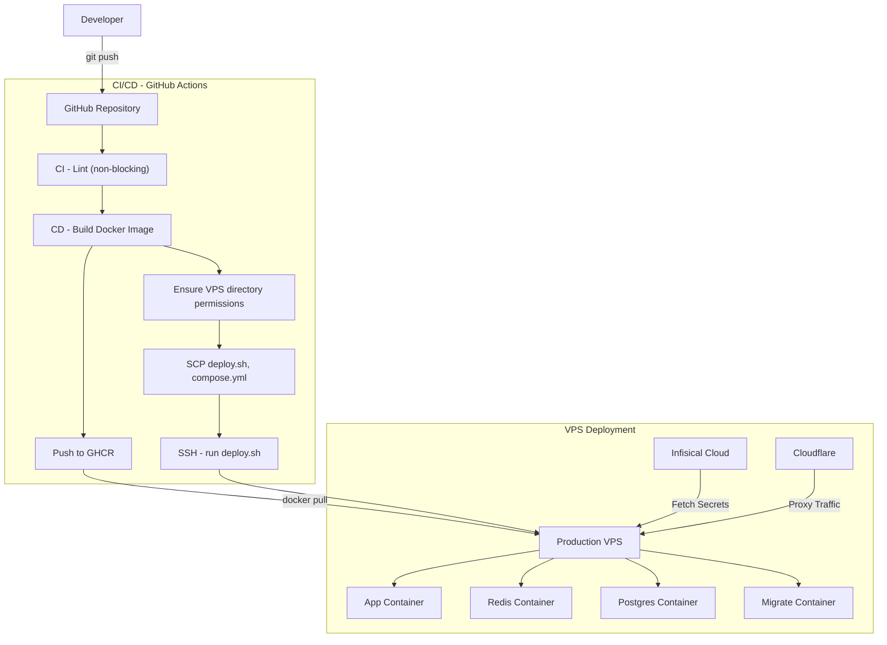

# Idea-dump
Idea Dump is a platform for sharing and storing ideas.
Live hosted on [ideas.soylab.dpdns.org](https://ideas.soylab.dpdns.org/).

## System Architecture

### 1. Deployment & CI/CD Pipeline


## Features

- **Idea Management**: Create, edit, and delete ideas
- **Health Check**: `/health` endpoint for monitoring

## Tech Stack

| Component | Technology |
|-----------|------------|
| Application | TypeScript, NestJS |
| Database | PostgreSQL |
| Cache | Redis |
| CI/CD | GitHub Actions |
| Registry | GitHub Container Registry (GHCR) |
| DNS/SSL | Cloudflare |
| Secrets | Infisical Cloud |
| Deployment | Docker Compose on VPS |

## Prerequisites

- Node.js 22+ (or use Docker)
- Docker and Docker Compose
- PostgreSQL 15+ (or use Docker)
- Redis 7+ (or use Docker)

## Local Development

### Quick Start

```bash
# Clone the repository
git clone https://github.com/gopal-chhetri/idea-dump.git
cd idea-dump

# Start all services (app, database, redis)
pnpm run start:dev

# Or with Docker Compose directly
cd deployments/local-dev
docker compose up --build
```

The app will be available at `http://localhost:3000`.


## Environment Variables

Copy `deployments/local-dev/.env.example` to `deployments/local-dev/.env` and configure:

## API Documentation

Once running, visit:
- **Swagger UI**: `http://localhost:3000/api/docs`

### Key Endpoints

> Note: routes have **no `/api` prefix** (the backend has no global prefix).
> `/api/auth/google/callback` is also served as a compatibility alias.

| Method | Path | Description | Auth |
|--------|------|-------------|------|
| POST | `/auth/register` | Register new user | No |
| POST | `/auth/login` | Login | No |
| GET | `/auth/google` | Start Google OAuth | No |
| GET | `/auth/google/callback` | Google OAuth callback | No |
| POST | `/ideas` | Create idea | Yes |
| GET | `/ideas` | List user's ideas | Yes |
| DELETE | `/ideas/:id` | Deactivate idea | Yes |

### Google OAuth Setup

1. In Google Cloud Console, under **APIs & Services → Credentials →
   OAuth 2.0 Client IDs**, configure the web client:
   - **Authorized JavaScript origins:** `https://ideas.soylab.dpdns.org`
   - **Authorized redirect URIs:** `https://ideas.soylab.dpdns.org/auth/google/callback`
2. Configure the secrets (via Infisical in prod):
   - `GOOGLE_CLIENT_ID`, `GOOGLE_CLIENT_SECRET`
3. `FRONTEND_URL` (e.g. `https://ideas.soylab.dpdns.org/app`) controls where the
   OAuth callback redirects the browser with the token pair.
4. `callbackURL` is derived from `FRONTEND_URL` (origin + `/auth/google/callback`)
   so it always matches the single registered redirect URI.

### CI/CD Pipeline

Push to `main` (or a `v*` tag) triggers:
1. **CI**: Lint (non-blocking) → Build
2. **CD**: Build Docker image → Push to GHCR → Ensure VPS permissions → SCP copies `compose.yml` + `deploy.sh` (migrations run from the image via the `migrate` service) → SSH `deploy.sh` on VPS

### Image Versioning

| Trigger | Tag | Example |
|---------|-----|---------|
| Push to main | `main-<sha>` | `main-abc1234` |
| Git tag | `v1.2.3` | `v1.2.3` |

## Roadmap & TODOs

- [ ] Add unit and integration test coverage for core redirection flows.
- [ ] Grafana and Prometheus setup for monitoring.

## License

MIT License